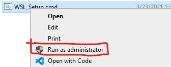
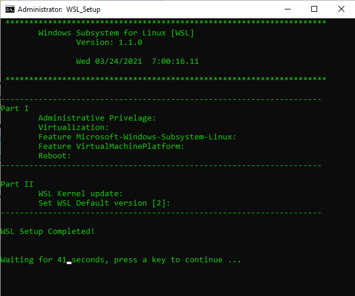

# [Windows Subsystem for Linux Version 2](https://docs.microsoft.com/en-us/windows/wsl/)

Use the [WSL2-Setup-Guide.md](https://github.com/cal-sc/WSL/blob/main/WSL2-Setup-Guide.md) installation guide to install and setup WSL

Use instllation script for automated installation:

[WSL_Setup.cmd](https://github.com/cal-sc/WSL/archive/refs/tags/v1.0.0.zip)

Be sure to run the program as an administrator:
- Right-click the program

- Select "Run as administrator"

If you run the automated setup, the computer must reboot, and you must run WSL_Setup.cmd a second time to complete the installation.

## Images

