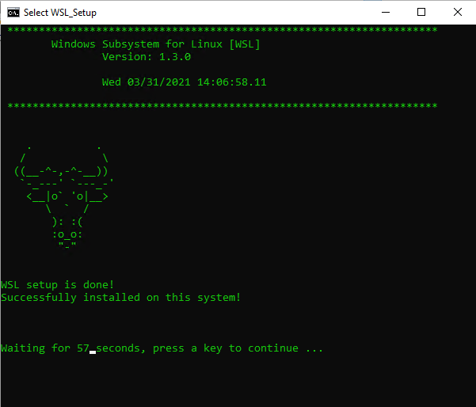
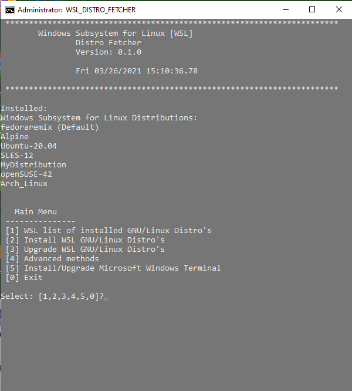
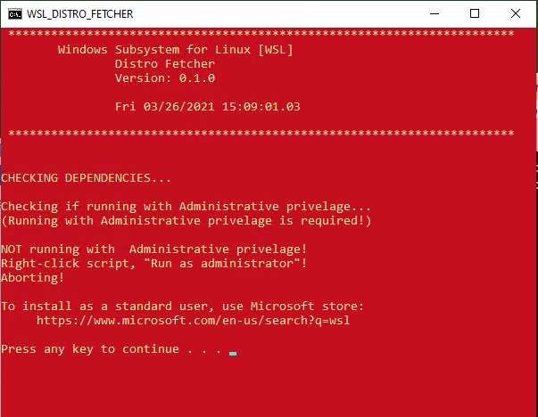

# [Windows Subsystem for Linux Version 2](https://docs.microsoft.com/en-us/windows/wsl/)

To install WSL on Windows:
`wsl.exe --install`

_Version must be Windows 10 2004 20H1 build 19041 or later_

Use the [WSL2-Setup-Guide.md](WSL2-Setup-Guide.md) for manually installing and setup of WSL for older versions of Window 10 -- less than 2004 20H1 Build 19041.

Reference the [User Guide](WSL_User_Guide.md) for common tasks.

Use installation script for automated installation:

[WSL_Setup.cmd](WSL_Setup.cmd)

Be sure to run the program as an administrator:
- Right-click the program

- Select "Run as administrator"

The installation is a 2 part process.
If you run the automated setup, the computer must reboot, and you must run WSL_Setup.cmd a second time to complete the installation.

## Images

